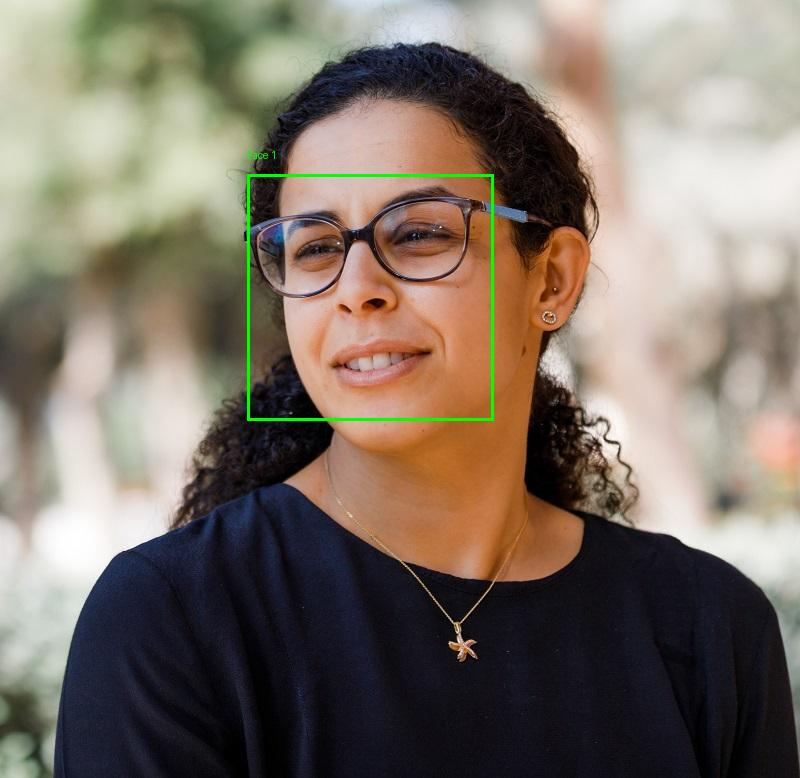

# Azure Cognitive Vision FaceAPI for Face Detection

Python project that uses **Azure Face API** to detect faces in images, draw bounding boxes, and report attributes (glasses, blur, occlusion). Output images are saved as `detected_<filename>.jpg`.

---

## Sample input and output

The script takes an image, sends it to the Azure Face API, and draws green boxes around each detected face with a label. It also prints attributes (e.g. glasses, blur level, occlusion) for each face.

| Input image | Output image (detected faces) |
|-------------|-------------------------------|
| Original photo | Faces detected and annotated with bounding boxes and attributes |

**Input image** — Original photo before processing:


**Output image** — After running the script: each face is outlined with a green rectangle, numbered (Face 1, Face 2, …), and the script prints attributes such as glasses, blur level, and occlusion for each face. The annotated image is saved as `detected_<filename>.jpg`.



---

## What is an Azure AI Vision Service?

- Provides tools to analyze images and videos for extracting information such as objects, text, and descriptions.
- Supports Optical Character Recognition (OCR) to extract printed and handwritten text from images and documents.
- Allows building and deploying custom models to meet specific visual analysis needs.
- Easily integrates with other Azure services and APIs for comprehensive AI solutions.

## What is an Azure Face Service?

- Detects and locates human faces in images with high precision.
- Identifies and verifies individuals by comparing faces against a database.
- Extracts facial attributes such as age, emotion, and gender from images.
- Offers secure and scalable face recognition solutions for applications like access control and identity verification.

---

## How to Run the Python Project

### Prerequisites

- Python 3.8+
- An **Azure Face** resource (not Computer Vision). Create one in [Azure Portal](https://portal.azure.com) → **AI Services** → **Face**, then open **Keys and Endpoint** and copy **Key 1** and **Endpoint**.

### Steps to Run

1. **Clone the repository**
   ```bash
   git clone https://github.com/YOUR_USERNAME/AzureCognitiveVisionFaceAPIDetection.git
   cd AzureCognitiveVisionFaceAPIDetection
   ```

2. **Create a virtual environment (recommended)**
   ```bash
   python -m venv venv
   source venv/bin/activate   # On Windows: venv\Scripts\activate
   ```

3. **Install dependencies**
   ```bash
   pip install -r requirements.txt
   ```

4. **Configure Azure credentials**
   - Copy `.env.example` to `.env`:
     ```bash
     cp .env.example .env
     ```
   - Edit `.env` and set your Face resource values (no quotes, no trailing slash on endpoint):
     ```
     AI_SERVICE_ENDPOINT=https://YOUR_RESOURCE_NAME.cognitiveservices.azure.com
     AI_SERVICE_KEY=your_key_1_from_portal
     ```

5. **Add test images (optional)**
   - Create an `images` folder and add JPEG images (e.g. `face1.jpg`, `face2.jpg`, `faces.jpg`), or change the `test_images` list in `analyze-faces.py` to match your filenames.

6. **Run the script**
   ```bash
   python analyze-faces.py
   ```
   - The script prints the config it is using, processes each image, and saves annotated images as `detected_<filename>.jpg` in the project folder.

### Troubleshooting

- **401 Access denied**: Ensure `.env` uses the **Face** resource’s Key and Endpoint (not Computer Vision). Regenerate the key in the portal if needed.
- **Missing images**: Create an `images` folder and add your own images, then update the `test_images` list in `analyze-faces.py` if needed.
